# C++ _ PDC _ #06

## :copyright: Autor

- :camera: 

- :man: **Miguel Angel Rojas Herrera**
- :e-mail: m_rojas18@unitec.edu
- :link: [github.com/m_rojas18](https://github.com/m-rojas18)
- :calendar: 2020-08-30 21:00 CST

---
## :dart: Objetivos
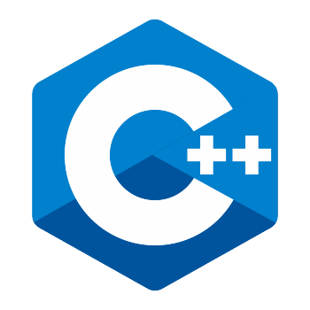

Punto de Control #06 en C++ mostrara: 

1. :nut_and_bolt: La diferencia en el uso de:
   - **static_cast** (comentar linea de `#define dynamic`)
   - **dynamic_cast** (habilitado por omisión)
   
2. Entender el uso de typeid

3. Entender uso de funciones virtuales

4. Entendimiento e implementación de operadores sobrecargados

## :large_blue_circle: 1) Ejemplo_static_cast.cpp
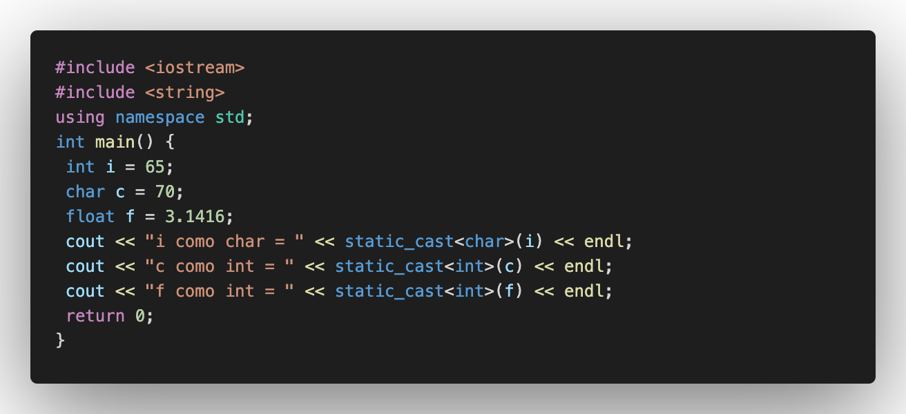
## :small_blue_diamond: Salida Ejemplo_static_cast.cpp
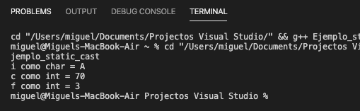

## Descripción: 
 - El programa hace uso de static_cast para convertir de un tipo a otro variables y luego imprimir la conversion.
 
 ## :large_blue_circle: 2) static_cast vs dynamic_cast 1.cpp
 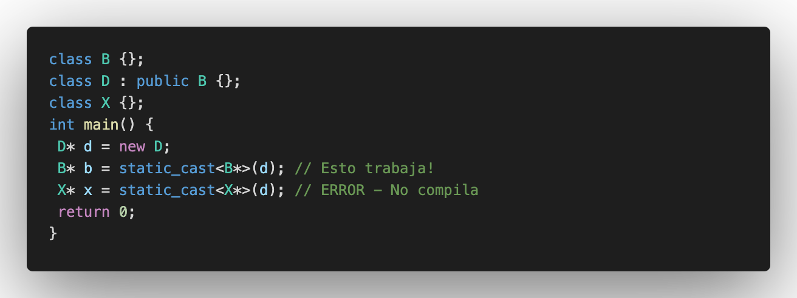
 ## :small_blue_diamond: Salida static_cast_vs_dynamic_cast 1.cpp
 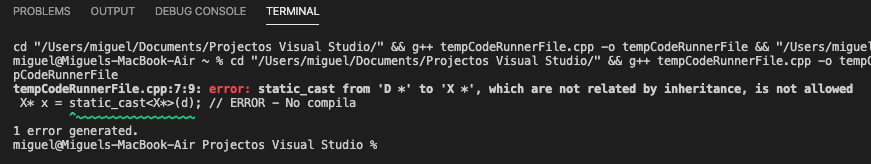
 
 ## Descripción:
 - El programa intenta mostrar el uso de static_cast vs dynamic_cast pero ocurre un error al momento de correr el programa.
 
 ## :large_blue_circle: 3) static_cast vs dynamic_cast 2.cpp
   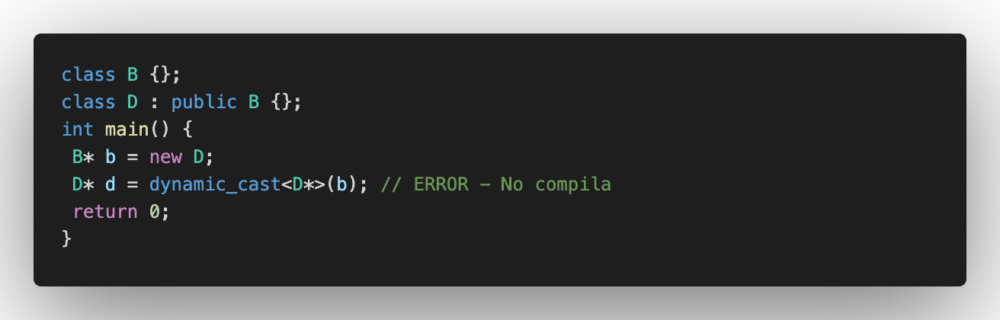
   
 ## :small_blue_diamond: Salida static_cast_vs_dynamic_cast 2.cpp
 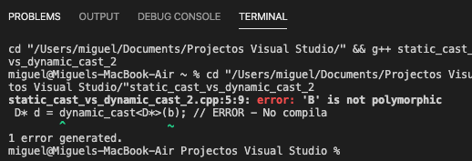
 
 ## Descripción:
 - Intento de comparacion que vuelve a fallar.
 
  ## :large_blue_circle: 4) static_cast vs dynamic_cast 3.cpp
   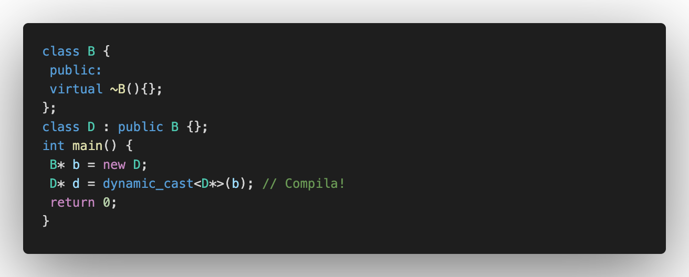
   
 ## :small_blue_diamond: Salida static_cast_vs_dynamic_cast 3.cpp
 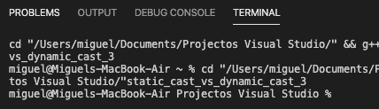
 
 ## Descripción:
 - Vemos que el programa compila de manera correcta.
 
 ## :large_blue_circle: 5) Ejemplo Funciones Virtuales.cpp
 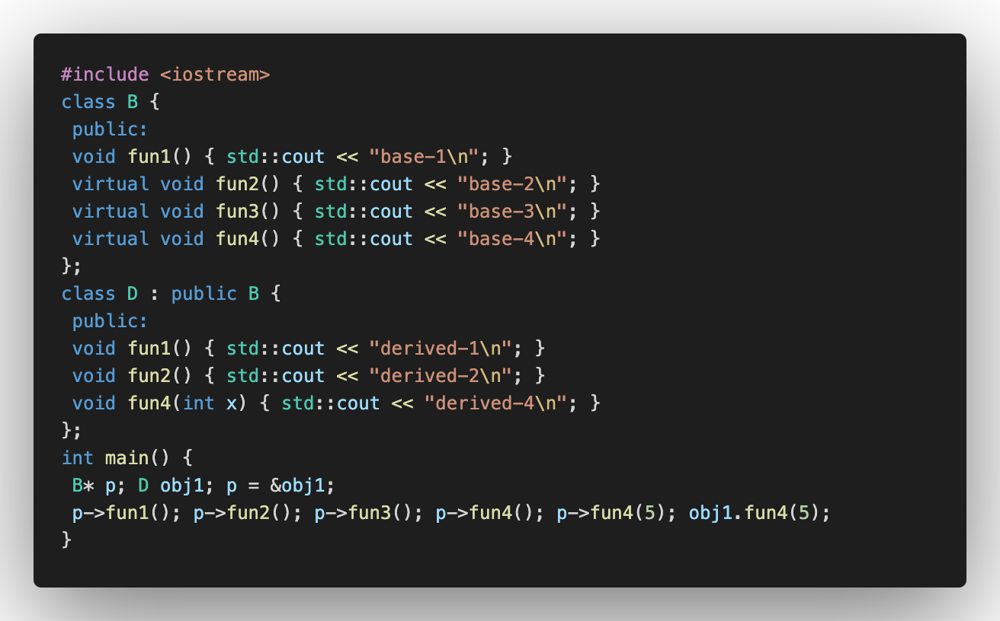
 
 ## :small_blue_diamond: Salida Ejemplo Funciones Virtuales.cpp
 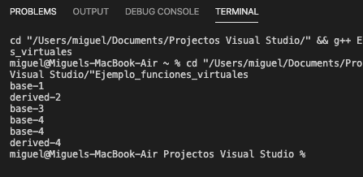
 
 ## Descripción:
 - El programa hace uso de funciones virtuales en las clases para hacer impresiones.
 
 ## :large_blue_circle: 6) Ejemplo typeid.cpp
 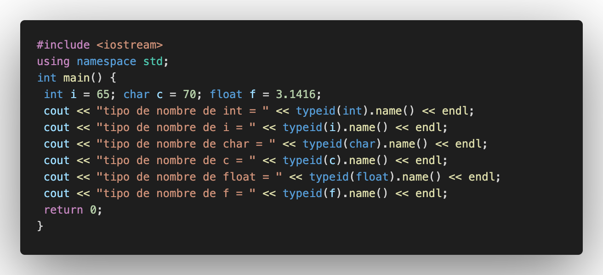
 
 ## :small_blue_diamond: Salida Ejemplo typeid.cpp
 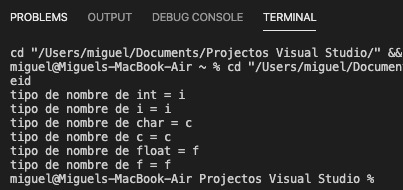
 
 ## Descripción: 
 - El programa hace uso de typeid para obtener el nombre de las variables.
 
 ## :large_blue_circle: 7) Ejemplo sobrecarga de operadores 1.cpp
 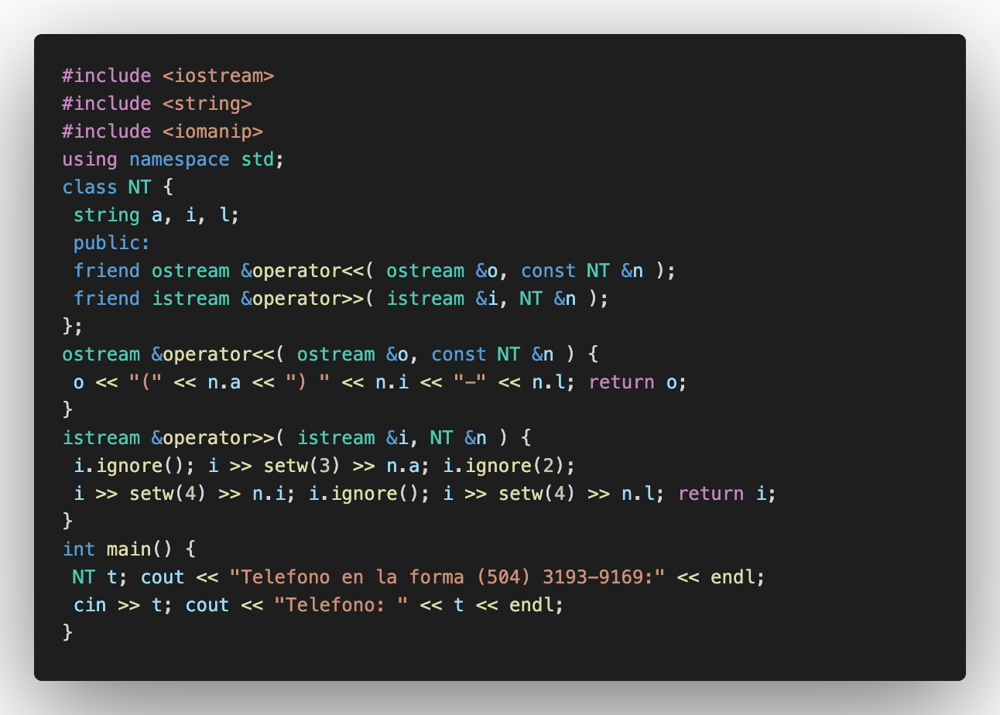
 
 ## :small_blue_diamond:: Salida Ejemplo sobrecarga de operadores 1.cpp
 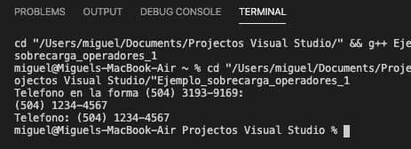
 
 ## Descripción:
 - El programa utiliza sobrecarga de operadores para darles usos especificos a ciertos caracteres y asi imprimir lo que pide el programa.
 
  ## :large_blue_circle: 8) Ejemplo sobrecarga de operadores 2.cpp
 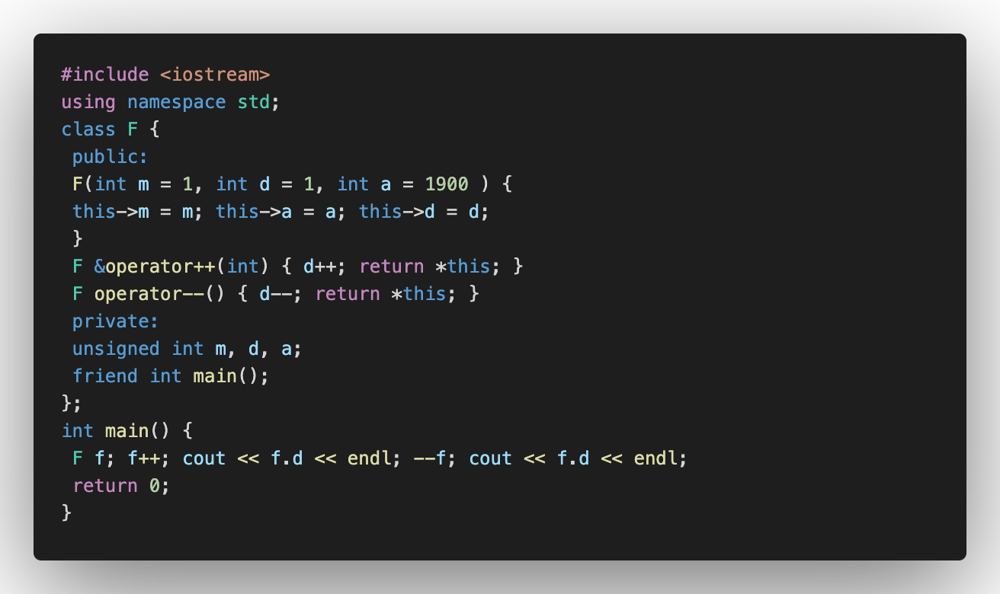
 
 ## :small_blue_diamond:: Salida Ejemplo sobrecarga de operadores 2.cpp
 
 
 ## Descripción:
 - El programa utiliza sobrecarga de operadores para darles usos especificos a ciertos caracteres para mostrar una resta.
 
 #### Herramientas:
- :package: [Visual Studio Code](https://code.visualstudio.com/)
- :camera: [Polacode-2020 v0.5.2](https://github.com/jeff-hykin/polacode)
- :notebook: [Markdown Cheatsheet](https://github.com/adam-p/markdown-here/wiki/Markdown-Cheatsheet)
- :smile: [Emoji Cheat Sheet](https://www.webfx.com/tools/emoji-cheat-sheet/)
